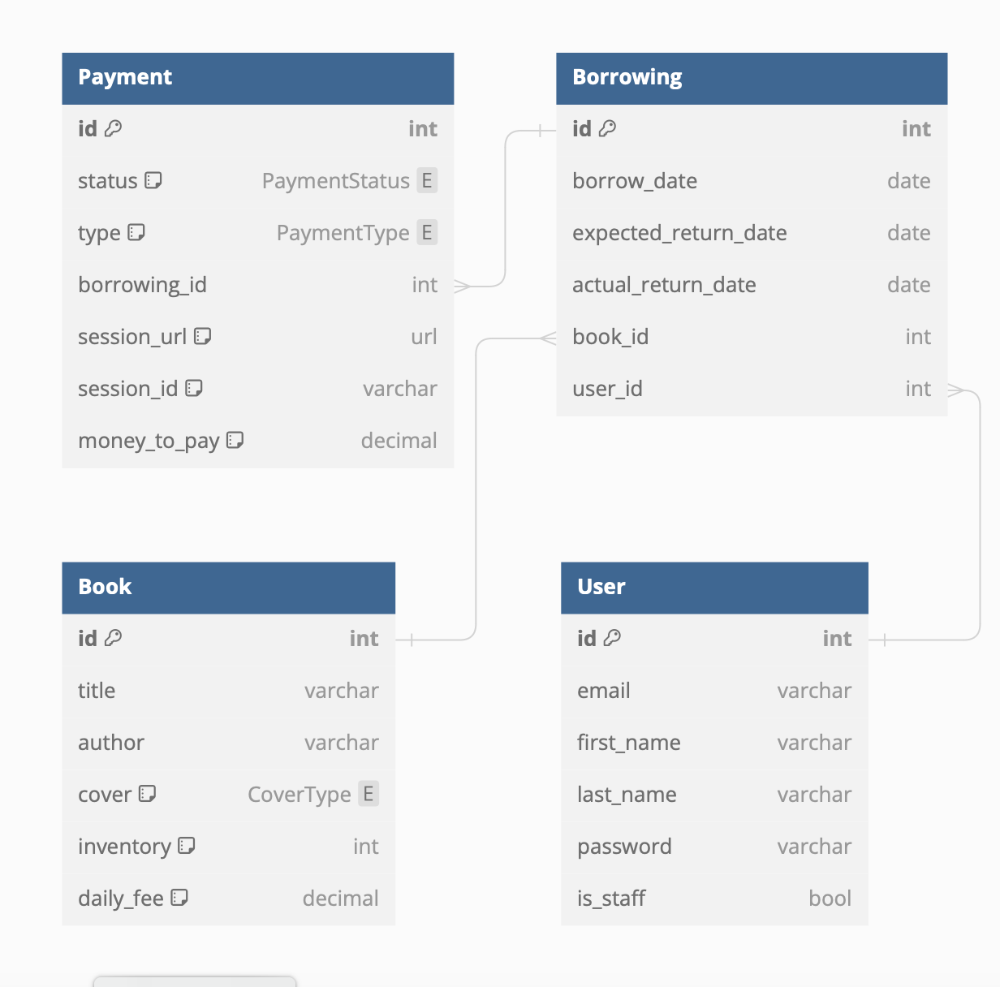

# Bravo

## Description

This repository hosts a fully developed RESTful project designed to address 
operational inefficiencies in a local library. The existing manual processes 
for book tracking, borrowing management, user records, and cash-only 
payments have been replaced with an online management system. The project 
introduces real-time book inventory checks, user-friendly borrowing interfaces, 
and comprehensive payment tracking. The RESTful services ensure seamless 
communication between users, administrators, and the library's database, 
enhancing overall efficiency and user experience.

## Requirements

TELEGRAM_BOT_TOKEN

TELEGRAM_CHAT_ID

STRIPE_API_KEY

## Installation

git clone https://github.com/Familenko/library-service-project.git

```
cd library-service-project
python -m venv venv 
source venv/bin/activate 
pip install -r requirements.txt 

python manage.py migrate
python manage-py runserver
```

Put required environment variables in .env file

Getting access
```
• create user via /api/user/register/
• get access token via /api/user/token/
```

## Features

• JWT authenticated

• Admin panel /admin/

• Documentation is located at /api/doc/swagger/

• Managing books, payments, borrowing, users

• Filtering books, payments, borrowing, users

• Telegram bot notifications

• Stripe payments

## Swagger

```
/api/doc/swagger/
```

